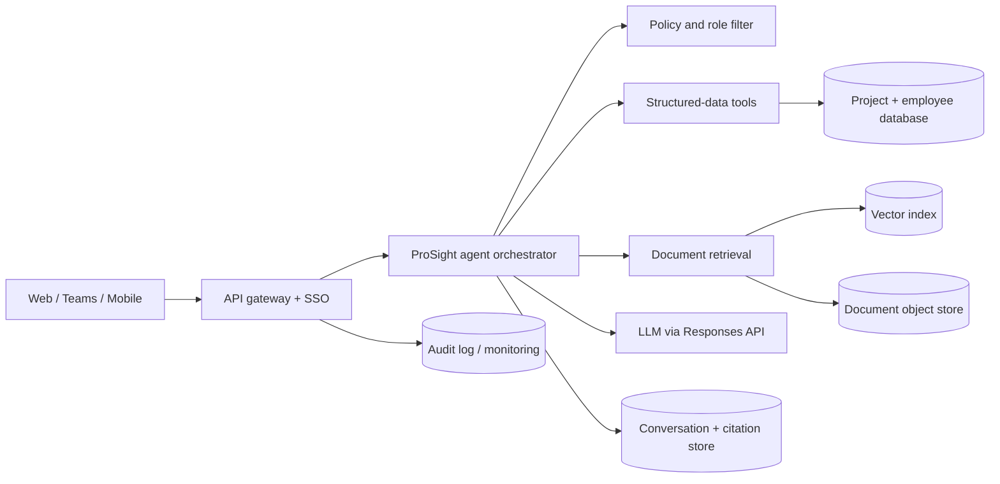

# ProSight AI architecture

## 1. Recommended production architecture

The model does not connect directly to databases. It can only call narrow,
read-only tools. Each tool applies project membership, role, and field-level
authorization before returning data. The final answer includes evidence IDs.

## 2. Three knowledge bases

The lifecycle categories need distinct retrieval rules even when they share
infrastructure.

| Knowledge base | Typical sources | Update pattern | Important rules |
|---|---|---|---|
| Active | daily reports, schedule, RFIs, manpower/equipment logs | hourly/daily | prefer latest approved revision; show data timestamp |
| Completed | as-built drawings, handover pack, lessons learned, final account | mostly immutable | preserve document revision and closeout approval |
| Future | tender, estimate, bid clarifications, resource forecast | event driven | tighter confidentiality; separate bid teams |

Use metadata filters (`company_id`, `project_id`, `lifecycle`, `document_type`,
`revision`, `approved`, `effective_date`, `security_classification`) before
semantic/vector retrieval. Never blend one project's evidence into another.

## 3. Data model

Core entities:

- `projects`: code, status, client, contract value, planned/revised dates.
- `progress_snapshots`: baseline, revised, actual, variance, reporting date.
- `employees`: company directory and contact fields.
- `project_assignments`: person, project, project role, start/end dates.
- `activities`, `manpower`, `equipment`, `manhours`, `milestones`.
- `documents` and `document_chunks`: source, revision, text, access metadata.
- `audit_events`: user, query, tools, project IDs, response, timestamp.

Derived calculations must be deterministic:

- `delay_days = max(0, revised_finish - planned_finish)`.
- `variance_pct = actual_progress_pct - revised_progress_pct`.
- Currency is stored as integer minor units in production.

## 4. Query flow

1. Authenticate with company SSO; obtain user identity, role, and projects.
2. Classify the request and extract project/status/time filters.
3. Authorize before retrieval.
4. Call structured tools for facts and document retrieval for narrative claims.
5. Generate an answer only from returned context.
6. Attach citations, data freshness, and a clear “not found” response.
7. Log tool calls and accessed project IDs without logging unnecessary PII.

## 5. Access policy

Suggested roles:

- `executive`: portfolio totals and all projects; business contacts.
- `project_manager`: assigned and supervised projects; full project contacts.
- `employee`: approved project facts; contact details masked.
- `bid_team`: future projects explicitly assigned to that bid team.
- `admin`: configuration and audit access, not automatically business-data access.

Enforce authorization inside the data service, not only in prompts. Encrypt
contact fields, use short-lived identity tokens, redact PII in telemetry, and
require an explicit reason for bulk directory exports.

## 6. Ingestion pipeline

1. Connect SharePoint/Drive/document systems and project databases.
2. Virus-scan, OCR, classify, and extract text/tables.
3. Resolve project and revision metadata; quarantine ambiguous documents.
4. Split by headings/tables, create embeddings, and index with ACL metadata.
5. Re-index only approved revisions; retain superseded versions for audit.
6. Run quality checks for dates, totals, duplicate people, and inconsistent units.

## 7. Production components

- API: FastAPI/.NET with OIDC, rate limiting, and request IDs.
- Data: PostgreSQL; object storage; managed vector search or `pgvector`.
- Jobs: queue-based ingestion and scheduled source reconciliation.
- Agent: OpenAI Responses API function calling with strict JSON schemas.
- Observability: traces, retrieval/tool metrics, answer feedback, audit export.

The prototype uses SQLite and a zero-dependency HTTP server so it can run
immediately. Replace those adapters without changing the agent's tool contract.

## 8. Evaluation and rollout

Start with a 50–100 question golden set covering exact facts, ambiguous project
names, access denial, outdated revisions, calculations, and “not in source.”
Track factual accuracy, citation correctness, authorization leakage, latency,
and cost. Roll out read-only to one active project first, then completed
projects, then confidential future work.
# Multi-agent document intelligence

The Main Orchestrator is the only conversation owner. It plans each query and
invokes the Database Manager Agent, RAG Agent, and Writer Agent as bounded tools.
Specialists cannot call each other. The Writer is the only specialist allowed
to produce user-facing prose.

PDF uploads are stored by project, extracted page-by-page, chunked, embedded
with `text-embedding-3-small`, and indexed in a persistent local Chroma
collection. Retrieval always includes a project-code filter and returns page
citations. Excel imports are validated into a change preview and cannot mutate
SQLite until an Admin approves the pending request.

FastAPI exposes query, upload, job, document, and approval resources. SQLite
persists workflow state and audit events; a bounded in-process worker handles
the portfolio deployment. Production evolution should replace the role selector
with SSO, SQLite with PostgreSQL, local files with object storage, and the local
worker with a durable queue.
