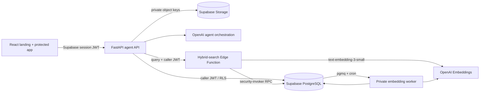

# ProSight AI architecture

## Runtime flow

FastAPI verifies each access token against the Supabase project JWKS, loads the
RLS-visible profile and memberships, and installs one request-scoped
`AuthContext`. API payloads cannot select or override a role. Structured reads
use the caller JWT; narrowly scoped ingestion state, approved mutations,
migration, audit, and embedding work use server credentials after API policy
checks.

## Data and access model

`profiles` is keyed to `auth.users`. New users receive the `employee` role and
memberships for every current project in the same signup transaction. A project
insert grants all employees access to the new project. Administrators bypass
project membership for portfolio operations; other roles require a row in
`project_memberships`.

RLS is enabled on all user-facing tables. Employees are read-only and contact
values are masked before they enter agent context or API responses. Project
authors can upload and update within their memberships. Destructive document
operations are administrator-only, and project deletion remains an approved
server-side change rather than a direct table delete. Notifications are owned
by `recipient_user_id`; changes and imports retain user ownership; audits retain
both actor user ID and the role snapshot at action time.

Storage is private. Project object keys are
`<project-code>/<document-id>/<filename>` and portfolio object keys are
`<user-id>/<import-id>/<filename>`. Storage RLS derives its scope from the
leading path segment.

## RAG foundation

`document_chunks` stores document/project IDs, filename, one-based page and
chunk numbers, content hash, effective date, metadata, token count, embedding
model/version/status, generated full-text vector, and `halfvec(1536)`.

PDF extraction never crosses page boundaries. Long pages are split into
overlapping token-aware sections, retaining page citation metadata. Inserts or
content/model changes clear the old embedding and enqueue a `pgmq` message.
The scheduled worker batches jobs, uses `text-embedding-3-small` with an
explicit 1536 dimensions, and applies bounded exponential retries. Parent
document and ingestion-job status is derived from its chunk statuses.

`hybrid_search` independently ranks full-text and cosine candidates, combines
them with reciprocal-rank fusion, adds a small effective-date preference, and
filters by ready document state, project code, and RLS membership before
returning evidence. Query embeddings are created by an authenticated Edge
Function so indexing and retrieval share the same model configuration.

## Migration and cutover

The SQLite migrator is repeatable and uses stable IDs/upserts. It converts role
strings to user ownership, uploads legacy files, downloads them for SHA-256
comparison, and reports source/migrated/target counts. Production remains on
the old read-only source until the verification gate passes; no dual writes are
introduced. The detailed process is in `docs/supabase-rollout.md`.
